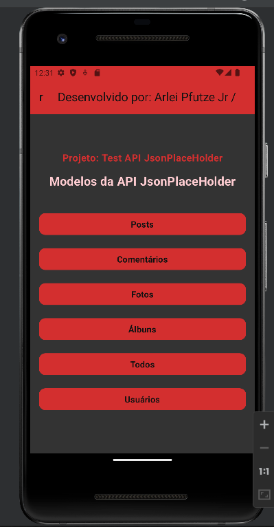
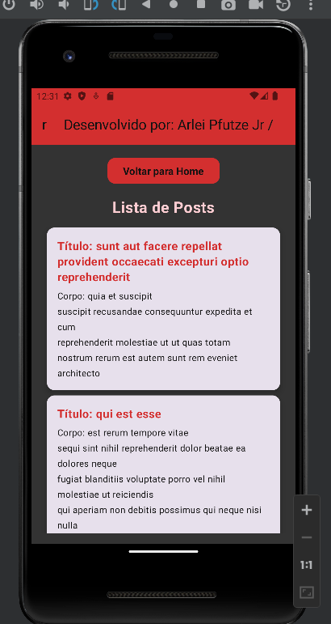
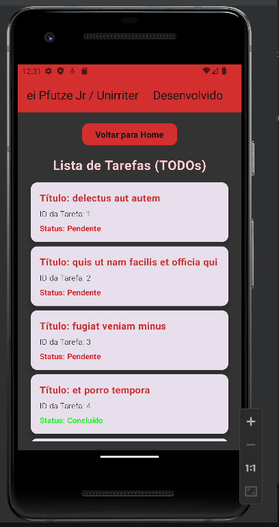

# **Aplicação Android - Desafio Acadêmico**

Este repositório contém a implementação de um projeto de aplicativo Android, desenvolvido como parte de um desafio acadêmico. A aplicação utiliza a biblioteca Jetpack Compose para criação da interface e integra-se à API pública do [JSONPlaceholder](https://jsonplaceholder.typicode.com/) para obter dados dinâmicos.

## **Resumo do Projeto**
O projeto é dividido em dois exercícios principais:
1. **Criação de uma Aplicação com Múltiplas Telas**: Exploração do Jetpack Compose para criar uma aplicação com transições entre várias telas.
2. **Integração com API REST**: Criação de modelos de dados, repositórios, e consumo de endpoints para exibição de informações.

---

## **Exercício 1: Criação de Aplicação com 6 Telas**

No primeiro exercício, o objetivo foi criar uma aplicação Android com pelo menos 6 telas, conectadas por um fluxo de navegação usando o Jetpack Navigation Component. Cada tela apresenta informações relevantes para o usuário.

### **Funcionalidades Implementadas**:
- **Navegação entre Telas**: Componente de navegação configurado para fácil transição entre as telas.
- **Interface Moderna**: Utilização do Jetpack Compose para criar um design responsivo e estilizado.

**Exemplo de Telas:**
- **Home Screen**: Tela inicial com botões para acessar as funcionalidades.
- **Post Screen**: Exibe uma lista de posts dinâmicos consumidos da API.
- **Comments Screen**: Lista de comentários associados aos posts.
- **Photo Gallery**: Galeria de fotos carregadas dinamicamente.
- **Album Screen**: Exibição de álbuns com seus títulos e IDs.
- **User Screen**: Apresentação das informações dos usuários.

---

## **Exercício 2: Integração com API REST**

No segundo exercício, o foco foi criar modelos de dados e configurar os serviços de repositório para integração com a API pública do [JSONPlaceholder](https://jsonplaceholder.typicode.com/).

### **Modelos Criados**:
- `Post`: Representa as postagens recuperadas do endpoint `/posts`.
- `Comment`: Modela os comentários relacionados aos posts (`/comments`).
- `Album`: Exibe álbuns do endpoint `/albums`.
- `Photo`: Representa fotos do endpoint `/photos`.
- `Todo`: Lista de tarefas (`/todos`).
- `User`: Informações de usuários recuperadas do endpoint `/users`.

### **Arquitetura do Projeto**:
- **Repository Pattern**: Cada modelo possui um repositório responsável por consumir os endpoints da API.
- **ViewModel**: Gerencia os estados e os dados dinâmicos exibidos em cada tela.
- **Jetpack Compose**: Utilizado para construção de UI declarativa e responsiva.

---

## **Exemplo de Uso**

### **Tela Inicial (Home Screen)**:
A tela inicial apresenta botões para navegar entre as funcionalidades da aplicação:



### **Exibição de Dados Dinâmicos**:
Os dados consumidos da API são exibidos em listas modernas com suporte a status e detalhes adicionais:

- **Exemplo de Posts**:
  

- **Exemplo de Tarefas**:
  

---

## **Tecnologias Utilizadas**
- **Kotlin**: Linguagem de programação para desenvolvimento Android.
- **Jetpack Compose**: Biblioteca para criação de interfaces modernas e responsivas.
- **Retrofit**: Biblioteca para consumo de APIs RESTful.
- **Coil**: Biblioteca para carregamento de imagens diretamente da web.
- **Coroutines**: Gerenciamento assíncrono para chamadas de API.

---

## **Como Executar o Projeto**
1. Clone o repositório:
   ```bash
   git clone https://github.com/ArleiPfutzeJr/meu-primeiro-app.git


